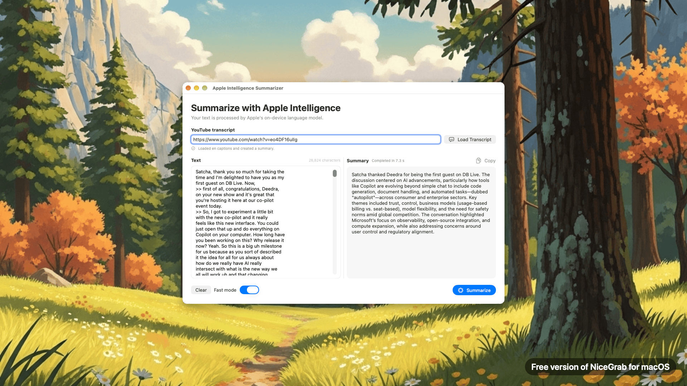

# Apple Intelligence Summarizer

A native macOS SwiftUI app that summarizes pasted text and YouTube transcripts
with Apple's on-device Foundation Models framework.



## Features

- Summarizes text locally with `SystemLanguageModel` and `LanguageModelSession`.
- Loads the default-language caption track from a pasted YouTube video URL.
- Automatically starts summarizing after a YouTube transcript is loaded.
- Supports ordinary YouTube watch links, short links, Shorts, embeds, and live URLs.
- Offers three processing modes:
  - **Fast mode** samples representative sentences throughout a long
    document and uses one model request.
  - **Smart mode** (default) uses native sentence embeddings to select a
    semantically diverse set of passages in one model request.
  - **Thorough mode** summarizes every chunk separately, then combines the
    partial summaries for better coverage.
- Limits the final result to one paragraph of at most 100 words.
- Shows live progress and total elapsed time.
- Includes copy, clear, and Command-Return controls.
- Explains when Apple Intelligence is disabled, unavailable, or still preparing
  its on-device model.

## Requirements

- macOS 26 or later
- Xcode 26 or later
- A Mac with Apple silicon that supports Apple Intelligence
- Apple Intelligence enabled with its on-device model downloaded

The direct Foundation Models API was introduced in macOS 26. Apple Intelligence
and Writing Tools may be present on macOS 15, but macOS 15 does not expose the
`FoundationModels` API used by this app.

## Run the app

1. Clone this repository.
2. Open `AppleIntelligenceSummarizer.xcodeproj` in Xcode.
3. Select the **AppleIntelligenceSummarizer** scheme and **My Mac** destination.
4. Press **Run**.

No package installation or API key is required.

## Usage

### Summarize pasted text

1. Paste text into the left editor.
2. Choose **Fast** for the quickest result, **Smart** for efficient semantic
   coverage, or **Thorough** for complete processing of a long document.
3. Click **Summarize** or press Command-Return.

### Summarize a YouTube video

1. Paste a YouTube video URL into the **YouTube transcript** field.
2. After a short debounce, the app loads the video's default caption track.
   Pressing Return or clicking **Load Transcript** also starts the load.
3. The raw caption text appears in the left editor and summarization begins
   automatically using the currently selected mode.

If the video is unavailable or has no captions, the app shows an inline error.

## How it works

### Apple Intelligence summarization

The app creates a fresh `LanguageModelSession` for each request and prompts the
on-device model to produce a short paragraph. Responses are capped at 160 tokens,
and the final pass asks for no more than 100 words.

Apple's on-device model has a 4,096-token context window. Long inputs therefore
cannot be submitted in one request:

- Fast mode uses `NLTokenizer` to select sentences at regular intervals across
  the entire document, fitting representative content into one request.
- Smart mode uses the native `NLEmbedding` sentence model and a budgeted
  facility-location algorithm to maximize semantic coverage in one request.
- Thorough mode divides the document at natural boundaries, summarizes each
  section in a separate fresh session, and recursively combines the results.

### YouTube captions

The caption loader follows the approach used by ReadTube:

1. Extract and validate the 11-character YouTube video ID.
2. Call YouTube's player endpoint using a sequence of Android, iOS, VR, web, and
   mobile-web client profiles.
3. Select YouTube's default translation-source caption track, falling back to
   the first track, and prefer the matching auto-generated track when present.
4. Download the corresponding `/api/timedtext` XML document.
5. Parse both legacy `<text>` and newer `srv3` `<p>` caption formats and place
   the cue text into the editor.

YouTube's player and timed-text endpoints are not a documented public API and
may change. The multiple client profiles provide fallbacks, but the integration
may need maintenance if YouTube changes its response format or access rules.

## Privacy and networking

- Summarization runs on-device through Apple Intelligence. The app does not send
  pasted text or loaded transcripts to an external summarization service.
- Loading a YouTube URL makes network requests to YouTube to retrieve video
  metadata and captions.
- No API key, account, analytics service, or custom backend is used.

## Project structure

```text
AppleIntelligenceSummarizer/
├── AppleIntelligenceSummarizerApp.swift  App entry point
├── ContentView.swift                     SwiftUI interface
├── SummaryViewModel.swift                Loading and summarization workflow
└── YouTubeTranscriptService.swift        YouTube metadata and caption client
```

`project.yml` is the XcodeGen source for the checked-in Xcode project. Run
`xcodegen generate` after changing project structure if you use XcodeGen.

## Build verification

The project is compiled from the command line with:

```sh
xcodebuild \
  -project AppleIntelligenceSummarizer.xcodeproj \
  -scheme AppleIntelligenceSummarizer \
  -configuration Debug \
  CODE_SIGNING_ALLOWED=NO \
  build
```

## License

No license has been specified yet.
